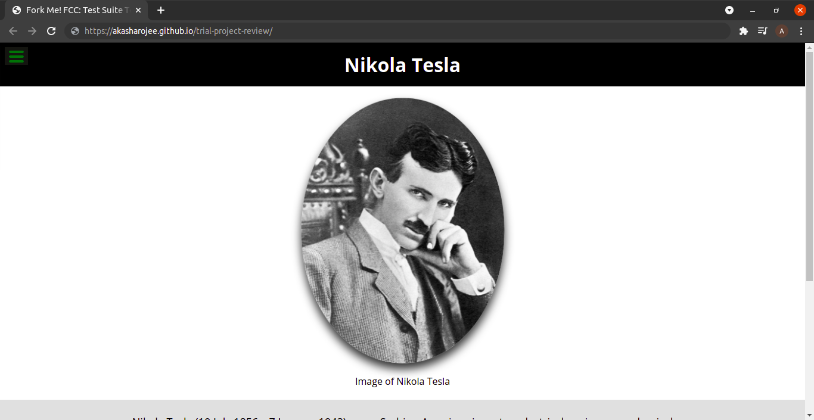

# Trial Project Review

> Review a project from Microverse trials

This project serves to perform a code review on our own code.

- Follow Microverse code review guidelines
- Check linter errors on GH
- Check for usage of semantic HTML tags
- Check for HTML & CSS best practices
- Suggest improvements

## Built With

- Major languages: HTML, SCSS, JS
- Frameworks: none
- Technologies used: Lighthouse, Webhint, Stylelint

## Live Demo

[Live Demo Link](https://akasharojee.github.io/trial-project-review/)

## Getting Started

To get a local copy up and running follow these simple example steps.

### Prerequisites

- Lighthouse
- Webhint
- Stylelint

### Setup

- Work on feature branch
- Add config files for linters
- Clone [original repo](https://vladanvi99.github.io/akasha-vladan/)

### Install

- Install Node Version Manager
- Install Node.js
- Install linters: Lighthouse, Webhint, Stylelint

### Usage

To run Lighthouse audit: lighthouse URL

To run Webhint: npx hint .

To run Stylehint: npx stylelint "**/*.{css,scss}"

### Deployment

Open pull request and perform code review according to Microverse guidelines.

## Authors of trial project

👤 **Akasha Rojee**

- GitHub: [@AkashaRojee](https://github.com/AkashaRojee)
- Twitter: [@AkashaRojee](https://twitter.com/AkashaRojee)
- LinkedIn: [Akasha Rojee](https://linkedin.com/in/AkashaRojee)

👤 **Vladan Videnovic**

- GitHub: [@Vladanvi99](https://github.com/vladanvi99)

## 🤝 Contributing

Contributions, issues, and feature requests are welcome!

Feel free to check the [issues page](https://github.com/AkashaRojee/trial-project-review/issues).

## Show your support

Give a ⭐️ if you like this project!

## Acknowledgments

- [@Vladanvi99](https://github.com/vladanvi99) for his collaboration on the trial project

## 📝 License

This project is [MIT](./MIT.md) licensed.